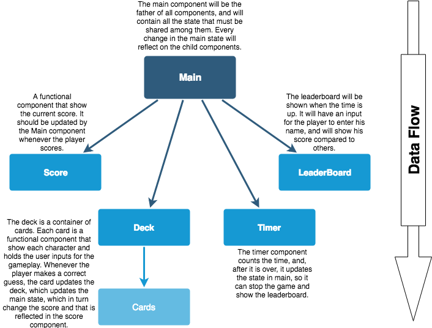

## SWars-Quiz

This project is a sample quiz-like little game, written using react, react-router, bootstrap, html, and css. It shows star wars characters photos, and the player have to guess the name of each character. For each unassisted guess the player gets 10pts. If the player request tips about the persona, it will get only 5pts. Incorrect guesses will not be punished.

### Componentization

I tried to make the best use possible of components. Bellow is the components schema for this app, and a little description of what each component do:

Most part of the application state is stored in the Main component, and each change in the state gets passed down to its children. The tree height is really short, so there is no pain in passing props down to the leaves components and thus redux was not needed.

### Routes

Although there is really only a single important route, which is the main page react-router was used anyway because of the intro screen, which has a start button for the game. So the routes are:

| route        | component          |
| ------------- |:-------------:|
| /    | The start screen  |
| /game      | The main screen       |

### API

Google Search API was consumed to get the character images for the game. Also the star wars api (swapi.co) was consumed to get characters, and its information.

### Images
The original idea was to use google's json custom search api for finding the images, but the process of making the search for the perfect image for every character was painful and inaccurate. Since the avatars are a crucial part of the game, those were included within the assets folder.

### How to run the app

1. Download or clone the repo
2. in the project folder >npm install
3. after complete do >npm start
